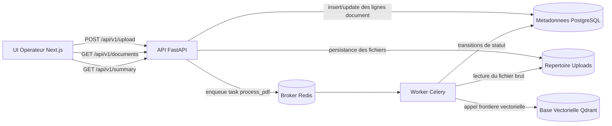
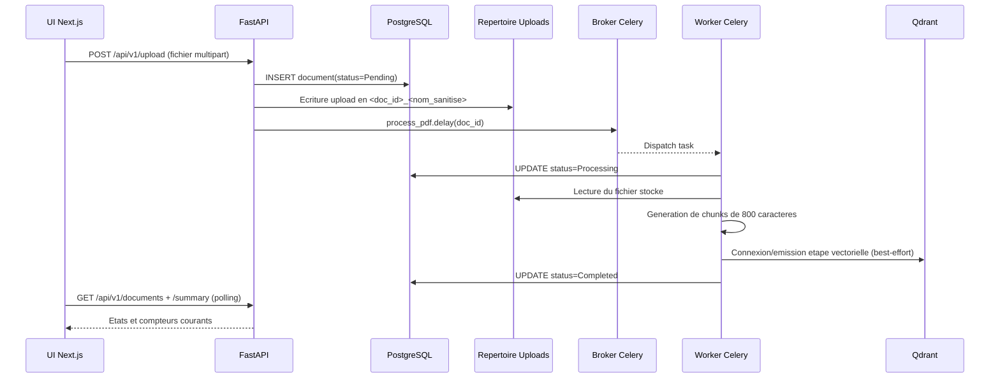

# Enterprise RAG Pipeline

Langue: [English](README.md) | Francais

Un plan de controle d'ingestion oriente production pour la Retrieval-Augmented Generation (RAG), centre sur la fiabilite, l'observabilite et des frontieres de service claires.

Ce depot est volontairement concu pour representer une colonne vertebrale d'ingestion reelle, et non une simple demo d'upload.

## Table des matieres

- [Problemes resolus par ce systeme](#problemes-resolus-par-ce-systeme)
- [Architecture](#architecture)
- [Flux d'ingestion de bout en bout](#flux-dingestion-de-bout-en-bout)
- [Inventaire des services](#inventaire-des-services)
- [Cartographie du depot](#cartographie-du-depot)
- [Modele de donnees](#modele-de-donnees)
- [Contrat API](#contrat-api)
- [Reference de configuration](#reference-de-configuration)
- [Modes d'execution](#modes-dexecution)
- [Parcours des implementations cles](#parcours-des-implementations-cles)
- [Runbook operationnel](#runbook-operationnel)
- [Depannage](#depannage)
- [Feuille de route engineering](#feuille-de-route-engineering)

## Problemes resolus par ce systeme

Les projets RAG echouent souvent au niveau ingestion avant que la qualite de retrieval ne devienne le vrai goulet d'etranglement:

- les uploads sont acceptes mais peu tracables
- la responsabilite du traitement est floue
- les pannes queue/storage n'ont pas de signal operateur
- les workflows locaux et conteneurises divergent

Ce projet repond a cela avec un design d'ingestion centre sur les statuts:

- API FastAPI pour intake des documents et consultation des statuts
- Worker Celery pour le traitement asynchrone
- Metadonnees SQL pour des transitions d'etat durables
- Frontiere Qdrant pour l'integration vectorielle
- Dashboard Next.js pour une visibilite en direct

## Architecture



### Intentions de design

- Le chemin request/response reste lean et deterministe.
- Le travail lourd est delegue a l'execution worker.
- Le statut est une primitive de domaine de premier plan (`Pending`, `Processing`, `Completed`).
- Le mode degrade local reste exploitable si queue/vector est indisponible.

## Flux d'ingestion de bout en bout



## Inventaire des services

| Service | Technologie | Responsabilite | Port par defaut |
| --- | --- | --- | --- |
| frontend | Next.js 15 + TypeScript | UI operateur pour upload, liste, resume, details | 3000 (compose), 3001 (script local) |
| api | FastAPI + SQLAlchemy | Ingestion upload, APIs de statut, agregation du resume | 8000 (compose), 8001 (script local) |
| worker | Celery | Cycle de vie asynchrone et frontiere vectorielle | N/A |
| db | PostgreSQL 15 | Persistance des metadonnees document | 5432 |
| redis | Redis | Broker/backend Celery en mode conteneur | 6379 |
| vector_db | Qdrant | Point d'integration vector store | 6333 |

## Cartographie du depot

| Chemin | Role |
| --- | --- |
| backend/main.py | App FastAPI, endpoint upload, endpoints document/summary, config CORS |
| backend/worker.py | App Celery, task de traitement, transitions de statut, generation des chunks |
| backend/database.py | Setup engine/session DB et boucle d'attente de connexion au demarrage |
| backend/models.py | Modele SQLAlchemy Document |
| frontend/src/components/Uploader.tsx | UX upload, drag-drop, dispatch POST |
| frontend/src/components/StatusList.tsx | Dashboard polling, cartes de resume, details par document |
| frontend/src/lib/apiClient.ts | Strategie de fallback pour base API selon l'environnement |
| scripts/dev-up.sh | Orchestration locale des process avec fichiers PID/log |
| scripts/dev-down.sh | Arret local des process et nettoyage des PID |
| docker-compose.yml | Topologie complete multi-services |

## Modele de donnees

### documents

| Colonne | Type | Notes |
| --- | --- | --- |
| id | Integer | Cle primaire |
| filename | String(255) | Nom de fichier original cote client |
| upload_status | String(50) | Etat de cycle de vie (`Pending`, `Processing`, `Completed`) |
| created_at | DateTime | Horodatage UTC a l'insertion |

### Cycle de vie des etats

| Transition | Declencheur |
| --- | --- |
| Pending -> Processing | Debut de la task worker sur un document |
| Processing -> Completed | Fin du chunking/etape vectorielle |
| * -> Pending | Chemin de rollback en cas d'exception worker |

## Contrat API

| Methode | Endpoint | Description | Reponse |
| --- | --- | --- | --- |
| GET | /health | Probe de liveness du service API | {"status":"ok"} |
| POST | /api/v1/upload | Persiste metadonnees + fichier et dispatch worker | {"id": integer} |
| GET | /api/v1/documents | Liste tous les documents (ordre desc par creation) | [{id, filename, upload_status, created_at}] |
| GET | /api/v1/documents/{id} | Recupere un document | {id, filename, upload_status, created_at} |
| GET | /api/v1/summary | Agrege les compteurs de statut | {Pending, Processing, Completed, Total} |

### Exemples d'appels

```bash
# Health
curl -s http://localhost:8001/health

# Upload
curl -s -X POST \
  -F "file=@./sample.pdf" \
  http://localhost:8001/api/v1/upload

# Liste des statuts
curl -s http://localhost:8001/api/v1/documents

# Resume
curl -s http://localhost:8001/api/v1/summary
```

## Reference de configuration

### Runtime backend

| Variable | Requise | Description | Exemple |
| --- | --- | --- | --- |
| DATABASE_URL | Oui | Chaine de connexion SQLAlchemy | postgresql://postgres:root@db:5432/postgres |
| CELERY_BROKER_URL | Oui | URL broker/backend Celery | redis://redis:6379/0 |
| QDRANT_URL | Oui | Endpoint Qdrant | http://vector_db:6333 |
| UPLOAD_DIR | Non | Repertoire de stockage des uploads | ./uploads |
| DB_CONNECT_MAX_ATTEMPTS | Non | Nombre max de retries de connexion DB | 30 |
| DB_CONNECT_DELAY_SECONDS | Non | Delai entre retries DB | 2 |
| FRONTEND_ORIGINS | Non | Origines CORS separees par virgules | <http://localhost:3000>,<http://localhost:3001> |

### Runtime frontend

| Variable | Requise | Description |
| --- | --- | --- |
| NEXT_PUBLIC_API_BASE_URL | Non | Base URL API preferee |
| NEXT_PUBLIC_API_BASE_URLS | Non | Bases API fallback separees par virgules |

apiClient.ts applique automatiquement des fallbacks de base API, en terminant par <http://localhost:8000> et <http://localhost:8001>.

## Modes d'execution

### 1) Mode conteneurise (principal)

```bash
docker compose up --build
```

URLs par defaut:

- Frontend: <http://localhost:3000>
- API: <http://localhost:8000>

### 2) Mode script local

```bash
cp .env.example .env
./scripts/dev-up.sh
```

Arreter les services:

```bash
./scripts/dev-down.sh
```

URLs locales par defaut:

- Frontend: <http://localhost:3001>
- API: <http://localhost:8001>

## Parcours des implementations cles

### 1) Intake et persistance securisee des fichiers

L'endpoint d'upload cree d'abord une ligne Document, puis ecrit les bytes sur disque avec un nom sanitize prefixe par l'id document pour l'unicite et la tracabilite.

```python
@app.post("/api/v1/upload")
async def upload_file(file: UploadFile = File(...)):
    document = Document(filename=file.filename, upload_status="Pending")
    db.add(document)
    db.commit()
    db.refresh(document)

    uploads_dir = Path(os.getenv("UPLOAD_DIR", "./uploads"))
    safe_name = _sanitize_filename(file.filename)
    destination = uploads_dir / f"{document.id}_{safe_name}"
    destination.write_bytes(await file.read())
```

### 2) Dispatch async avec fallback degrade

Si l'infrastructure queue est indisponible, le systeme execute quand meme le traitement de facon synchrone comme chemin de degradation graceful.

```python
try:
    process_pdf.delay(document.id)
except Exception:
    process_pdf(document.id)
```

### 3) Discipline de statut worker

Le worker met a jour le statut au debut et a la fin de la task, puis reinitialise a Pending en cas d'exception.

```python
document.upload_status = "Processing"
session.commit()

# ... lecture fichier + chunking + frontiere vectorielle

document.upload_status = "Completed"
session.commit()
```

### 4) Polling UI et observabilite

Le dashboard poll la liste des documents et le resume toutes les 4 secondes pour fournir une visibilite operateur sans rechargement de page.

```tsx
useEffect(() => {
  fetchItems();
  const interval = window.setInterval(fetchItems, 4000);
  return () => window.clearInterval(interval);
}, [fetchItems, refreshKey]);
```

## Runbook operationnel

### Health checks rapides

```bash
curl -s http://localhost:8001/health
curl -s http://localhost:8001/api/v1/summary
```

### Logs locaux

```bash
tail -f .backend.log
tail -f .frontend.log
```

### Controle des process

```bash
./scripts/dev-up.sh
./scripts/dev-down.sh
```

## Depannage

| Symptome | Cause probable | Action |
| --- | --- | --- |
| Missing .env | Configuration runtime non initialisee | cp .env.example .env |
| No module named uvicorn | Dependances backend manquantes | installer backend/requirements.txt dans l'environnement Python actif |
| npm: not found | Runtime Node absent en mode hote/local | installer Node 20+ ou utiliser le mode conteneur |
| EADDRINUSE sur le port frontend | Ancien serveur dev encore actif | arreter l'ancien process ou changer de port |
| Upload ok mais MAJ de statut lente | Worker/broker indisponible | verifier la sante Redis/Celery ou utiliser le fallback degrade |

## Feuille de route engineering

Prochaines iterations a fort impact:

1. Politiques de retry + strategie dead-letter pour les tasks en echec.
2. Logs structures avec correlation ids entre API et worker.
3. AuthN/AuthZ et frontieres document multi-tenant.
4. Vrai pipeline de parsing/chunking document (PDF, DOCX extraction).
5. Embedding + gestion des collections dans Qdrant.
6. Tests de contrat et d'integration sur les frontieres API/worker.

## Resume

Ce codebase montre deja les patterns d'architecture attendus sur un systeme d'ingestion de niveau senior:

- offloading async avec etat observable
- comportement runtime resilient sous panne partielle d'infrastructure
- chemins d'execution sensibles a l'environnement
- frontieres de service explicites pretes pour evoluer vers des plateformes RAG enterprise
