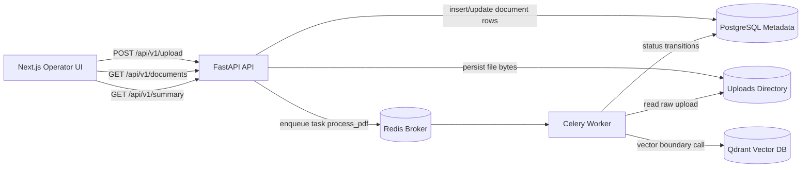
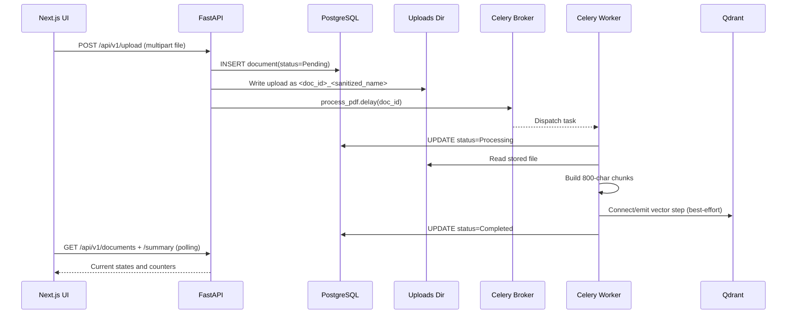

# Enterprise RAG Pipeline

Language: English | [Francais](README.fr.md)

A production-oriented ingestion control plane for Retrieval-Augmented Generation (RAG), focused on reliability, observability, and clean service boundaries.

This repository is intentionally designed to model a real ingestion backbone rather than a demo upload screen.

## Table of Contents

- [What This System Solves](#what-this-system-solves)
- [Architecture](#architecture)
- [End-to-End Ingestion Flow](#end-to-end-ingestion-flow)
- [Service Inventory](#service-inventory)
- [Repository Map](#repository-map)
- [Data Model](#data-model)
- [API Contract](#api-contract)
- [Configuration Reference](#configuration-reference)
- [Run Modes](#run-modes)
- [Core Implementation Walkthrough](#core-implementation-walkthrough)
- [Operational Runbook](#operational-runbook)
- [Troubleshooting](#troubleshooting)
- [Engineering Roadmap](#engineering-roadmap)
- [Summary](#summary)

## What This System Solves

RAG projects often fail at ingestion before retrieval quality becomes the bottleneck:

- uploads are accepted but not traceable
- processing ownership is unclear
- queue and storage failures have no operator signal
- local and container workflows diverge

This project addresses that with a status-first ingestion design:

- FastAPI API for document intake and status queries
- Celery worker for asynchronous processing
- SQL metadata for durable state transitions
- Qdrant boundary for vector integration
- Next.js operations dashboard for live visibility

## Architecture



### Design Intent

- Request/response path is kept lean and deterministic.
- Heavy work is delegated to worker execution.
- Status is a first-class domain primitive (`Pending`, `Processing`, `Completed`).
- Local degraded mode remains usable if queue/vector infrastructure is unavailable.

## End-to-End Ingestion Flow



## Service Inventory

| Service | Technology | Responsibility | Default Port |
| --- | --- | --- | --- |
| `frontend` | Next.js 15 + TypeScript | Operator UI for upload, list, summary, drill-down | `3000` (compose), `3001` (local script) |
| `api` | FastAPI + SQLAlchemy | Upload ingestion, status APIs, summary aggregation | `8000` (compose), `8001` (local script) |
| `worker` | Celery | Async processing lifecycle and vector boundary | N/A |
| `db` | PostgreSQL 15 | Document metadata persistence | `5432` |
| `redis` | Redis | Celery broker/backend in container mode | `6379` |
| `vector_db` | Qdrant | Vector store integration point | `6333` |

## Repository Map

| Path | Purpose |
| --- | --- |
| `backend/main.py` | FastAPI app, upload endpoint, document/summary endpoints, CORS config |
| `backend/worker.py` | Celery app, processing task, status transitions, chunk generation |
| `backend/database.py` | DB engine/session setup and boot-time connection wait loop |
| `backend/models.py` | SQLAlchemy `Document` model |
| `frontend/src/components/Uploader.tsx` | Upload UX, drag-drop, POST dispatch |
| `frontend/src/components/StatusList.tsx` | Polling dashboard, summary cards, per-document details |
| `frontend/src/lib/apiClient.ts` | API base fallback strategy for varied runtime environments |
| `scripts/dev-up.sh` | Local process orchestration with PID/log files |
| `scripts/dev-down.sh` | Local process shutdown and PID cleanup |
| `docker-compose.yml` | Full multi-service runtime topology |

## Data Model

### `documents`

| Column | Type | Notes |
| --- | --- | --- |
| `id` | `Integer` | Primary key |
| `filename` | `String(255)` | Original client filename |
| `upload_status` | `String(50)` | Lifecycle state (`Pending`, `Processing`, `Completed`) |
| `created_at` | `DateTime` | UTC timestamp at insert |

### State Lifecycle

| Transition | Trigger |
| --- | --- |
| `Pending -> Processing` | Worker task starts for a document |
| `Processing -> Completed` | Worker finishes chunking/vector step |
| `* -> Pending` | Worker exception rollback path |

## API Contract

| Method | Endpoint | Description | Response |
| --- | --- | --- | --- |
| `GET` | `/health` | Liveness probe for API service | `{"status":"ok"}` |
| `POST` | `/api/v1/upload` | Persist metadata + file and dispatch worker | `{"id": <int>}` |
| `GET` | `/api/v1/documents` | List all documents (desc by creation time) | `[{id, filename, upload_status, created_at}]` |
| `GET` | `/api/v1/documents/{id}` | Fetch single document | `{id, filename, upload_status, created_at}` |
| `GET` | `/api/v1/summary` | Aggregate status counters | `{Pending, Processing, Completed, Total}` |

### Example Calls

```bash
# Health
curl -s http://localhost:8001/health

# Upload
curl -s -X POST \
  -F "file=@./sample.pdf" \
  http://localhost:8001/api/v1/upload

# List statuses
curl -s http://localhost:8001/api/v1/documents

# Summary
curl -s http://localhost:8001/api/v1/summary
```

## Configuration Reference

### Backend Runtime

| Variable | Required | Description | Example |
| --- | --- | --- | --- |
| `DATABASE_URL` | Yes | SQLAlchemy connection string | `postgresql://postgres:root@db:5432/postgres` |
| `CELERY_BROKER_URL` | Yes | Celery broker/backend URL | `redis://redis:6379/0` |
| `QDRANT_URL` | Yes | Qdrant endpoint | `http://vector_db:6333` |
| `UPLOAD_DIR` | No | Uploaded file storage directory | `./uploads` |
| `DB_CONNECT_MAX_ATTEMPTS` | No | DB readiness retry count | `30` |
| `DB_CONNECT_DELAY_SECONDS` | No | Delay between DB retries | `2` |
| `FRONTEND_ORIGINS` | No | Comma-separated CORS origins | `http://localhost:3000,http://localhost:3001` |

### Frontend Runtime

| Variable | Required | Description |
| --- | --- | --- |
| `NEXT_PUBLIC_API_BASE_URL` | No | Preferred API base URL |
| `NEXT_PUBLIC_API_BASE_URLS` | No | Comma-separated fallback API bases |

`apiClient.ts` automatically falls back through candidate bases, ending with `http://localhost:8000` and `http://localhost:8001`.

## Run Modes

### 1) Containerized Mode (Primary)

```bash
docker compose up --build
```

Default URLs:

- Frontend: `http://localhost:3000`
- API: `http://localhost:8000`

### 2) Local Script Mode

```bash
cp .env.example .env
./scripts/dev-up.sh
```

Stop services:

```bash
./scripts/dev-down.sh
```

Default local URLs:

- Frontend: `http://localhost:3001`
- API: `http://localhost:8001`

## Core Implementation Walkthrough

### 1) Intake and Safe File Persistence

The upload endpoint creates a `Document` row first, then writes bytes to disk using a sanitized filename prefixed with document id for uniqueness and traceability.

```python
@app.post("/api/v1/upload")
async def upload_file(file: UploadFile = File(...)):
    document = Document(filename=file.filename, upload_status="Pending")
    db.add(document)
    db.commit()
    db.refresh(document)

    uploads_dir = Path(os.getenv("UPLOAD_DIR", "./uploads"))
    safe_name = _sanitize_filename(file.filename)
    destination = uploads_dir / f"{document.id}_{safe_name}"
    destination.write_bytes(await file.read())
```

### 2) Async Dispatch With Degraded Fallback

If queue infrastructure is unavailable, the system still executes processing synchronously as a graceful degradation path.

```python
try:
    process_pdf.delay(document.id)
except Exception:
    process_pdf(document.id)
```

### 3) Worker Status Discipline

The worker updates status at task start and completion, and resets to `Pending` on exceptions.

```python
document.upload_status = "Processing"
session.commit()

# ... file read + chunking + vector boundary

document.upload_status = "Completed"
session.commit()
```

### 4) UI Polling and Observability

The dashboard polls document list and summary every 4 seconds to provide operator-grade visibility without page reloads.

```tsx
useEffect(() => {
  fetchItems();
  const interval = window.setInterval(fetchItems, 4000);
  return () => window.clearInterval(interval);
}, [fetchItems, refreshKey]);
```

## Operational Runbook

### Health and Quick Checks

```bash
curl -s http://localhost:8001/health
curl -s http://localhost:8001/api/v1/summary
```

### Local Logs

```bash
tail -f .backend.log
tail -f .frontend.log
```

### Process Control

```bash
./scripts/dev-up.sh
./scripts/dev-down.sh
```

## Troubleshooting

| Symptom | Likely Cause | Action |
| --- | --- | --- |
| `Missing .env` | Runtime config not initialized | `cp .env.example .env` |
| `No module named uvicorn` | Backend dependencies missing | install `backend/requirements.txt` in active Python env |
| `npm: not found` | Node runtime not installed in host/local mode | install Node 20+ or use container mode |
| `EADDRINUSE` on frontend port | Previous dev server still running | stop old process or change port |
| Upload succeeds but slow status updates | Worker/broker unavailable | verify Redis/Celery health or rely on degraded fallback |

## Engineering Roadmap

High-impact next iterations:

1. Retry policies + dead-letter strategy for failed tasks.
2. Structured logging with correlation ids across API and worker.
3. AuthN/AuthZ and tenant-aware document boundaries.
4. True document parsing/chunking pipeline (PDF, DOCX extraction).
5. Embedding + collection management in Qdrant.
6. Contract and integration tests for API/worker boundaries.

## Summary

This codebase already demonstrates the core architecture patterns expected from senior-level ingestion systems:

- async offloading with observable state
- resilient runtime behavior under partial infrastructure failure
- environment-aware execution paths
- explicit service boundaries ready for extension into enterprise RAG platforms
